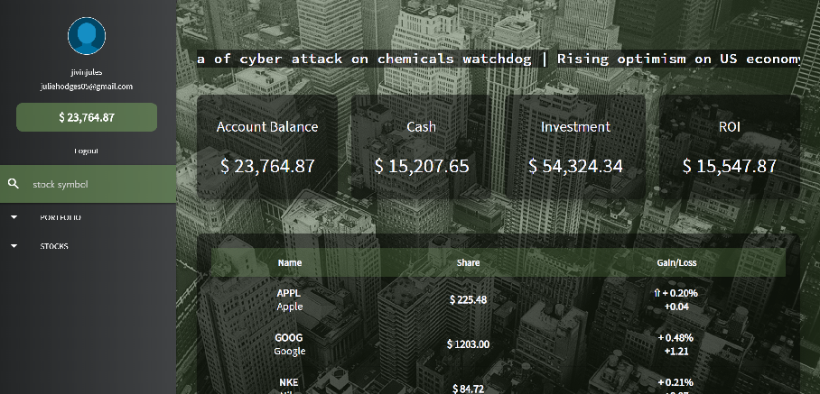

# Trading-Grounds
*All the Experience. None of the Risk.*

## Overview
Trading Grounds is a revolutionary education tool that simulates the stock market and allows the user to gain experience in buying, selling, and tracking a portfolio.  This app allows the user to experience the highs and lows of the stock market and gain experience while not risking the loss of any capital.  Trading Grounds provides a mock portfolio with real-time stock information as well as accurate historical stock data. The user is prompted to create an account and is then redirected to the dashboard which displays their overall portfolio.  Additionally, they are allowed to "buy" and "sell" stocks based on current real-time stock prices, track their investments.  Lastly, the sidebar provides information regarding the market cap, volume, and top movers.

## Developers' Toolkit
Trading Grounds was developed using:
1. *Front end*: HTML, CSS, Handlebars, JavaScript, jQuery
2. *Back end*: Node, Express, MySQL, AJAX
3. *npm Packages*: Sequelize, [Plotly](https://plot.ly/javascript/), [Moment](https://momentjs.com/), [Passport.js](http://www.passportjs.org/), Yahoo-Finance, Colors, Body-Parser, Express, Express-Validator, bcrypt-nodejs
4. *Additional Technologies*: [Bootstrap](http://getbootstrap.com/), [Materialize CSS](https://materializecss.com/), [jQuery Web Ticker](https://maze.digital/webticker/), [Google Fonts](https://fonts.google.com/)

## Contributors
[Cody Thompson](https://github.com/cdt12988), [Dustin McGilvray](https://github.com/DustinMcGilvray), and [Julie Hodges](https://github.com/jivinjules)

## Live Link on Heroku
Explore [Trading Grounds](https://radiant-coast-91135.herokuapp.com/stocks/movers/nasdaq).

